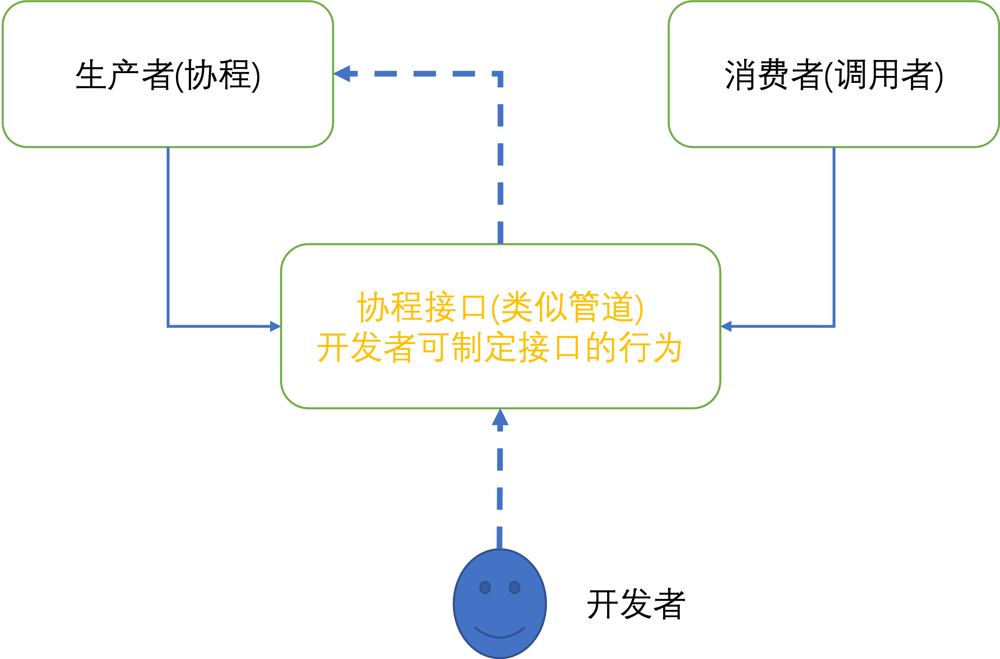

# 基本概念 (是什么)

**协程(coroutine):** 是一种特殊的函数，其可以被暂停(suspend), 恢复执行(resume)。一个协程可

以被多次调用。

**协程(coroutine):** 分为stackless和stackful两种，所谓stackless协程是指协程被suspend时不

需要堆栈，而stackful协程被suspend时需要堆栈。C++中的协程属于stackless协程。

C++20开始引入的协程由于如下等原因难以学习

- 围绕协程实现的相应组件多(譬如co_wait, co_return, co_yield， promise，handle等组件)

- 灵活性高，有些组件提供的接口多，可由用户自己控制相应的实现

- 组件之间的关系也略复杂

- 编译器内部转换

首先，实现自己的第一个协程

# 体验协程

C++20与协程相关的组件包括

- 协程接口(也即协程返回类)

- promise对象

- coroutine handle

- awaitable 和 awaiter

- 以及相应的三个关键字 co_wait, co_return, co_yield

下面看一个实际的hello协程的例子，其代码实现为

```c++
// coro_task.h
#include <coroutine>
#include <exception>
#include <type_traits>

class Task {
public:
  struct promise_type;
  using TaskHd1 = std::coroutine_handle<promise_type>;
private:
  TaskHd1 hd1_;

public:
  Task(auto h) : hd1_{h} {}
  ~Task() {
    if (hd1_) { hd1_.destroy(); }
  }

  Task(const Task&) = delete;
  Task& operator=(const Task&) = delete;

  bool resume() {
    if (!hd1_ || hd1_.done()) {
        return false;
    }
    hd1_.resume();
    return true;
  }

public:
  struct promise_type {
    /* data */
    auto get_return_object() {
        return Task{TaskHd1::from_promise(*this)};
    }
    auto initial_suspend() { return std::suspend_always{};}
    void unhandled_exception() { std::terminate();}
    void return_void() {}
    auto final_suspend() noexcept { return std::suspend_always{}; } 
  };
};

```

```c++
// main.cc
#include <iostream>

#include "coro_task.h"

 Task hello(int max) {
    std::cout << "hello world\n";
    for (int i = 0; i < max; ++i) {
        std::cout << "hello " << i << "\n";
        co_await std::suspend_always{};
    }
    
    std::cout << "hello end\n";
}

int main() {
    auto co = hello(3);
    while (co.resume()) {
        std::cout << "hello coroutine suspend\n";
    }
    return 0;
}
```

编译器构建命令为
```c++
g++ -o main main.cc coro_task.h -std=c++20
```

运行结果如下

```c++
hello world
hello 0
hello coroutine suspend
hello 1
hello coroutine suspend
hello 2
hello coroutine suspend
hello end
hello coroutine suspend
```

从总体上来看，协程和调用者之间的关系可由下图表示



在图中，可以把协程看作生产者，调用者看作消费者，把协程的返回值(协程接口，看作泛管道)。

此外图中出现的编程人员主要负责根据c++标准所提供的接口，可自定义泛管道的一些行为，以控制协程进行不同的操作。

若要实现一个协程，需要首先提供一个协程接口，譬如Task，在协程接口中需要提供

- promise_type

- std::coroutine_handle<promise_type>

在协程的函数体中需要使用co_await, co_yield, co_return之一的关键词。

## hello协程工作过程

此部分主要讲解hello协程的工作过程

- a. 协程的调用同函数相同，在main函数中，通过如下形式调用协程

```c++
auto co = hello(3);
```

- b. 通过调用hello(3), 启动协程，协程立即暂停(suspend), 并返回协程接口Task对象给调用者

- c. 在main函数中，调用co实例的resume接口，通过coroutine handle恢复协程的执行

- d. 在协程中，进入for循环，初始化局部变量，并到达暂停点(suspend point), 暂停点由co_await expr确定

- e. 协程暂停后将控制权转移到main函数，main函数继续运行并从新恢复协程

- f. 协程恢复执行，继续for循环，i的值增加。再一次到达暂停点(suspend point)。转换控制权到main函数。

- g. 最终for循环结束，协程离开for循环。并将控制权返回到到main函数，main函数退出循环，并销毁协程。

## promise_type

promise_type可以用来控制协程的行为。详细来说，promise_type给开发者提供了如下能力

- 与coroutine交互(从coroutine接受消息，以及将消息发送给coroutine)

- 创建coroutine handle

- 控制coroutine的suspend时机（在coroutine的入口和结尾）

- 提供了异常处理

一个promise_type有如下接口

```c++
struct promise_type
{
    coroutine get_return_object() { return {coroutine::from_promise(*this)}; }
    std::suspend_always initial_suspend() noexcept { return {}; }
    std::suspend_always final_suspend() noexcept { return {}; }
    void return_void() {}
    void unhandled_exception() {}
    auto yeid_value(val);
    auto return_value(val);
    auto await_transform(...);
    operator new(sz);
    operator delete(ptr, sz);
    auto get_return_object_on_allocation_failure();
};
```

一个类(模版类)只要实现了promise type所需要的接口，那么该类便可以用作协程的promise_type。一个简单的模版promise_type类如下

```c++
#include <coroutine>
#include <exception>

template <typename Type>
struct CoroPromise {
  auto get_return_object() {
      return std::coroutine_handle<CoroPromise<Type>>::from_promise(*this);
  }

  auto initial_suspend() { return std::suspend_always{}; }

  void unhandled_exception() { std::terminate(); }

  void return_void() {}

  auto final_suspend() noexcept { return std::suspend_always{}; }
};
```
上述接口说明如下

*get_return_object():* 主要用来初始化协程接口，用来作为协程的返回值。 该函数一般做两件事情

- 创建coroutine handle. 通过std::coroutine_handle的静态成员函数from_promise创建和初始化

- 利用创建的coroutine handle初始化协程接口

*initial_suspend():* 定制coroutine启动时的行为。  eagerly 或者 lazily。

-  当返回值为std::suspend_never{}，coroutine 立马执行(eagerly)

-  当返回值为std::suspend_always{}，coroutine 立马暂停(suspending, lazily)

*return_void():* 定制coroutine到达结尾或者碰到co_return 语句时的行为。当promise_type声明并定义了该成员函数，那么coroutine必须不能返回任何值。

*unhandled_exception():* 定制coroutine处理异常的方式。可以重新抛出异常也可以直接调用std::terminate()

*final_suspend():* 定制coroutine是否被最终suspend。这个函数需要保证不能抛出异常，且应该总是返回std::suspend_always{}

## coroutine_handle

coroutine_handle表示一个正在执行或者暂停(suspend)的coroutine。在C++20中，coroutine_handle由标准模版

std::coroutine_handle<>表示。 std::coroutine_handle的模版参数为promise_type的类型。

目前C++20针对std::coroutine_handle提供了三种版本，分别为

- 
```c++
template <>
struct std::coroutine_handle<void>;
``` 

- 
   ```c++
     template <typename Promise = void>
     struct std::coroutine_handle;
  ```

- 
   ```c++
   template<>
   struct coroutine_handle<std::noop_coroutine_promise>;
   ```

struct std::coroutine_handle<void>; 可以存储任何种类的协程

struct std::coroutine_handle; 存储由Promise制定的协程

struct coroutine_handle<std::noop_coroutine_promise>; 存储一个no-op的协程。


